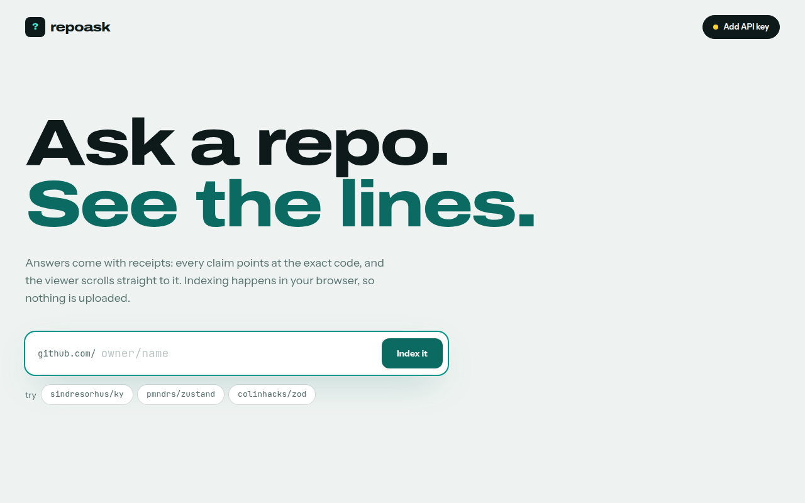
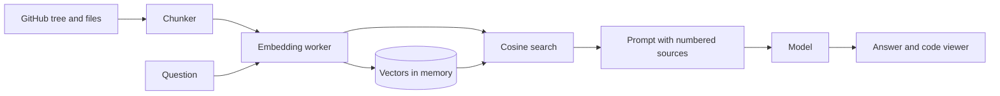

# repoask

Ask a public GitHub repository questions and get answers that point at the exact lines.



- Ask a public repository questions and get cited answers
- In-browser indexing with local embeddings, no repository content uploaded
- Code viewer that scrolls to the exact cited lines
- Retrieval works without a key; a key is only for the written answer

repoask is both **human-first** (the web UI below) and **agent-first** (an
MCP server any AI agent can call directly — see
[For AI agents: the MCP server](#for-ai-agents-the-mcp-server)). Both modes
call the exact same indexing and retrieval logic; see
[One engine, two entry points](#one-engine-two-entry-points) for how.

## Try it

**Live demo:** https://repoask.vercel.app

[](https://vercel.com/new/clone?repository-url=https%3A%2F%2Fgithub.com%2Fedgeorgie%2Frepoask)

```bash
npm install
npm run dev
```

Open http://localhost:3000. Requires Node 22 or newer.

1. Enter owner/name and press Index it.
2. Ask a question or pick a suggestion.
3. Pick a citation to open the file at those lines. Add an API key for written answers.

## For AI agents: the MCP server

repoask also exposes a real **MCP (Model Context Protocol) server** at
`/api/mcp` — so an agent can index a repo and ask it questions directly,
with the same exact-line citations the human UI shows, no browser and no
human in the loop. **Live:** https://repoask.vercel.app/api/mcp

### Tools

| Tool | What it does |
|---|---|
| `index_repo(owner, repo, ref?)` | Fetches a public repo's text files, chunks them into overlapping line-range windows, and embeds every chunk with the local MiniLM model (`Xenova/all-MiniLM-L6-v2`) — entirely on the server, no paid key required. |
| `ask_repo(owner, repo, question, topK?)` | Embeds the question with the same model, finds the closest chunks by cosine similarity, diversifies across files, and returns `path` + `startLine`/`endLine` + `score` + `excerpt` citations. Auto-indexes on first ask. If `ANTHROPIC_API_KEY` or `OPENAI_API_KEY` is set on the server, also returns a synthesized prose answer with inline `[n]` citations; otherwise `answerMode` is `"deterministic"` and the citations array is the full answer. |
| `list_indexed_repos()` | Debugging helper — lists `owner/repo` keys held in this warm instance's memory. Empty after a cold start; call `index_repo` again. |

Tool names and shapes intentionally match the sibling
[edgeorgie/repoask-mcp](https://github.com/edgeorgie/repoask-mcp) project for
consistency across both products — but the two use **different retrieval
engines** (this one: the real MiniLM embeddings repoask's browser UI uses;
repoask-mcp: TF-IDF, since it has no in-browser Web Worker to borrow a model
download from). They are deliberately kept as two independent repos/products,
not merged.

### Connect to it

```json
{
  "mcpServers": {
    "repoask": {
      "url": "https://repoask.vercel.app/api/mcp"
    }
  }
}
```

Or directly with the official SDK's `Client`:

```ts
import { Client } from "@modelcontextprotocol/sdk/client/index.js";
import { StreamableHTTPClientTransport } from "@modelcontextprotocol/sdk/client/streamableHttp.js";

const transport = new StreamableHTTPClientTransport(new URL("https://repoask.vercel.app/api/mcp"));
const client = new Client({ name: "my-agent", version: "1.0.0" });
await client.connect(transport);

const { tools } = await client.listTools();
await client.callTool({ name: "index_repo", arguments: { owner: "octocat", repo: "Spoon-Knife" } });
const result = await client.callTool({
  name: "ask_repo",
  arguments: { owner: "octocat", repo: "Spoon-Knife", question: "What does this repo demonstrate?" },
});
console.log(result.structuredContent.citations);
```

[`examples/run-http-session.ts`](examples/run-http-session.ts) is exactly
this — a real external client harness you can run yourself against the live
deployment or a local dev server:

```bash
node --experimental-strip-types examples/run-http-session.ts https://repoask.vercel.app/api/mcp
```

It writes the full raw request/response transcript to
[`examples/http-transcript.json`](examples/http-transcript.json) — real
`index_repo`/`ask_repo` calls against a real public repo (`octocat/Spoon-Knife`),
with genuine citations (exact `path`/`startLine`/`endLine`/`score`), not
fabricated output.

### One engine, two entry points

The human UI (`app/page.tsx`) and the MCP server (`app/api/mcp/route.ts`)
both call the **same** chunking/vector/prompt modules —
`lib/chunk.ts`, `lib/vector.ts`, `lib/rag.ts`, `lib/repo.ts`, `lib/indexer.ts`
— nothing is forked. The one real difference is *where the embedding model
runs*, because a browser Web Worker has no equivalent inside a Node
server process:

| Concern | Browser (human UI) | Server (MCP tools) |
|---|---|---|
| Embedding model | `lib/embedder.ts` + `lib/embed.worker.ts` — `Xenova/all-MiniLM-L6-v2` in a Web Worker | `lib/embedder.server.ts` — the **identical** `Xenova/all-MiniLM-L6-v2` model, loaded inline in the Node process via `@huggingface/transformers`'s Node backend |
| Indexing/retrieval | `lib/indexer.ts`, `lib/vector.ts`, `lib/chunk.ts`, `lib/rag.ts` | **Same modules**, called from `lib/engine.server.ts` |
| Answer key | Typed into the browser, sent only to the provider (`lib/llm.ts`, `lib/keystore.ts`) | Read from `ANTHROPIC_API_KEY`/`OPENAI_API_KEY` on the server (`lib/engine.server.ts`) — there's no browser to hold a per-visitor key for an agent caller |
| Index cache | In-memory in the tab; lost on refresh | In-memory per warm serverless instance; lost on cold start (call `index_repo` again) |

Both paths produce the same embeddings for the same text (same model, same
weights, same pooling/normalization) — citations and scores from the MCP
tools are not an approximation of what the human UI shows.

Shared contract: `lib/embedder-types.ts` defines a minimal `Embeddable`
interface (`embed(texts): Promise<Float32Array[]>`) that both
`lib/embedder.ts` (browser) and `lib/embedder.server.ts` (server) implement,
so `lib/indexer.ts` doesn't know or care which one it's talking to.

## Configuration

The web UI needs no environment variables — API keys are entered in the app
and stay in the browser. The MCP server (`/api/mcp`) optionally reads
`ANTHROPIC_API_KEY` or `OPENAI_API_KEY` from the server's environment for
prose answer synthesis (set via `vercel env add` or your host's equivalent);
without either, `ask_repo` still returns real citations, just no written
answer (`answerMode: "deterministic"`).

## How it works



The indexer lists the tree with one API call, downloads files from raw.githubusercontent.com, chunks them and embeds in a worker. A question is embedded, matched against chunk vectors, and the top passages are sent to the model. Full diagrams and the module map are in [docs/architecture.md](docs/architecture.md).

## Key concepts

| Term | Meaning |
|---|---|
| Chunk | A window of lines from one file with its original line numbers. |
| Embedding | A vector that represents the meaning of text, computed locally with MiniLM. |
| Cosine similarity | How close two embeddings point; used to rank chunks against a question. |
| Retrieval | Selecting the most relevant chunks before asking the model. |
| Citation | A numbered marker in the answer that maps to a chunk and opens it in the viewer. |
| Diversity cap | At most two chunks per file so one file cannot crowd out the rest. |

## Design system

Typography: Display, Archivo, extended width, weight 800; Text, Instrument Sans; Code, JetBrains Mono.

| Token | Value | Use |
|---|---|---|
| `bg` | `#eef3f1` | Page background |
| `ink` | `#0e1a1a` | Primary text |
| `ink-soft` | `#55706c` | Secondary text |
| `teal` | `#0b6b62` | Primary action and citations |
| `teal-bright` | `#2dd4bf` | Highlight in the code viewer |
| `code panel` | `#11171c` | Code viewer and blocks |

- Answers carry receipts: every claim is one click from the code.
- Light interface with a dark code panel for contrast.

Motion, components and rationale: [docs/design-system.md](docs/design-system.md).

## Data flow and privacy

| Data | Where it goes | Stored |
|---|---|---|
| Repository files | Fetched from GitHub, processed in the browser | Memory only |
| Embeddings | Computed in a worker | Memory only |
| Question and top passages | Sent to the chosen model provider | Not stored |
| Provider key | localStorage, sent only to the provider | This browser |

## Limits

- Public repositories only, up to 120 text files of 80 KB.
- GitHub allows 60 unauthenticated API calls per hour per IP; each index uses two.
- The first run downloads a 23 MB embedding model.

## Deployment

The human UI is fully client-side and can be hosted as static files; the
MCP server (`/api/mcp`) needs a Node server (it runs the MiniLM embedding
model server-side via `@huggingface/transformers`'s Node/onnxruntime-node
backend — Node APIs, not available on GitHub Pages' static hosting).

- **GitHub Pages (UI only, no MCP server):** `npm run deploy:pages` builds a static export and publishes it to the `gh-pages` branch. Enable Pages from that branch; on a free plan the repository must be public.
- **Vercel or any Node host (UI + MCP server):** use the Deploy button above. No configuration is needed — `serverExternalPackages` and `outputFileTracingIncludes` in `next.config.ts` are already set so Vercel's build correctly bundles `onnxruntime-node`'s native binding for the `/api/mcp` serverless function (the CUDA/TensorRT provider binaries are excluded; inference runs CPU-only).

## Documentation

| Document | What it answers |
|---|---|
| [docs/index.md](docs/index.md) | Map of all documentation |
| [docs/architecture.md](docs/architecture.md) | Diagrams and modules |
| [docs/spec/spec.md](docs/spec/spec.md) | Requirements and acceptance criteria |
| [docs/spec/traceability.md](docs/spec/traceability.md) | Requirement to code, test and evidence |
| [docs/design-system.md](docs/design-system.md) | Tokens, motion, components |
| [docs/glossary.md](docs/glossary.md) | Definitions |
| [docs/evaluation.md](docs/evaluation.md) | Self-assessment against a review rubric |
| [docs/adr](docs/adr) | Decision records |

## For AI agents and tools

- [AGENTS.md](AGENTS.md) defines the workflow and quality gates for agents and people.
- [llms.txt](public/llms.txt) is served at `/llms.txt` when deployed and points to the key documents.
- [docs/spec/requirements.json](docs/spec/requirements.json) is the machine-readable requirement list with status, files and tests.
- `npm run verify` is the single deterministic gate: typecheck, lint, traceability check, tests and build.

LLM integration: Repository text is untrusted input to the model (indirect prompt injection is possible). The model has no tools, is told to answer only from the numbered sources, and its output is rendered as text.

## Scripts

| Script | Purpose |
|---|---|
| `npm run dev` | Development server |
| `npm run build` | Production build |
| `npm run typecheck` | TypeScript check |
| `npm run lint` | ESLint |
| `npm test` | Unit tests |
| `npm run spec:check` | Traceability gate |
| `npm run verify` | All of the above |

## Contributing

See [CONTRIBUTING.md](CONTRIBUTING.md). Security reports: [SECURITY.md](SECURITY.md).

## License

MIT. Uses Transformers.js (Apache-2.0).
