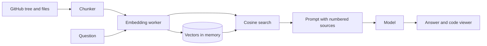

# repoask

Ask a public GitHub repository questions and get answers that point at the exact lines.

- Ask a public repository questions and get cited answers
- In-browser indexing with local embeddings, no repository content uploaded
- Code viewer that scrolls to the exact cited lines
- Retrieval works without a key; a key is only for the written answer

## Try it

[](https://vercel.com/new/clone?repository-url=https%3A%2F%2Fgithub.com%2Fedgeorgie%2Frepoask)

```bash
npm install
npm run dev
```

Open http://localhost:3000. Requires Node 22 or newer.

1. Enter owner/name and press Index it.
2. Ask a question or pick a suggestion.
3. Pick a citation to open the file at those lines. Add an API key for written answers.

## Configuration

No environment variables. API keys are entered in the app and stay in the browser.

## How it works



The indexer lists the tree with one API call, downloads files from raw.githubusercontent.com, chunks them and embeds in a worker. A question is embedded, matched against chunk vectors, and the top passages are sent to the model. Full diagrams and the module map are in [docs/architecture.md](docs/architecture.md).

## Key concepts

| Term | Meaning |
|---|---|
| Chunk | A window of lines from one file with its original line numbers. |
| Embedding | A vector that represents the meaning of text, computed locally with MiniLM. |
| Cosine similarity | How close two embeddings point; used to rank chunks against a question. |
| Retrieval | Selecting the most relevant chunks before asking the model. |
| Citation | A numbered marker in the answer that maps to a chunk and opens it in the viewer. |
| Diversity cap | At most two chunks per file so one file cannot crowd out the rest. |

## Design system

Typography: Display, Archivo, extended width, weight 800; Text, Instrument Sans; Code, JetBrains Mono.

| Token | Value | Use |
|---|---|---|
| `bg` | `#eef3f1` | Page background |
| `ink` | `#0e1a1a` | Primary text |
| `ink-soft` | `#55706c` | Secondary text |
| `teal` | `#0b6b62` | Primary action and citations |
| `teal-bright` | `#2dd4bf` | Highlight in the code viewer |
| `code panel` | `#11171c` | Code viewer and blocks |

- Answers carry receipts: every claim is one click from the code.
- Light interface with a dark code panel for contrast.

Motion, components and rationale: [docs/design-system.md](docs/design-system.md).

## Data flow and privacy

| Data | Where it goes | Stored |
|---|---|---|
| Repository files | Fetched from GitHub, processed in the browser | Memory only |
| Embeddings | Computed in a worker | Memory only |
| Question and top passages | Sent to the chosen model provider | Not stored |
| Provider key | localStorage, sent only to the provider | This browser |

## Limits

- Public repositories only, up to 120 text files of 80 KB.
- GitHub allows 60 unauthenticated API calls per hour per IP; each index uses two.
- The first run downloads a 23 MB embedding model.

## Deployment

The app is fully client-side, so it can be hosted as static files.

- **GitHub Pages:** `npm run deploy:pages` builds a static export and publishes it to the `gh-pages` branch. Enable Pages from that branch; on a free plan the repository must be public.
- **Vercel or any Node host:** use the Deploy button above. No configuration is needed.

## Documentation

| Document | What it answers |
|---|---|
| [docs/index.md](docs/index.md) | Map of all documentation |
| [docs/architecture.md](docs/architecture.md) | Diagrams and modules |
| [docs/spec/spec.md](docs/spec/spec.md) | Requirements and acceptance criteria |
| [docs/spec/traceability.md](docs/spec/traceability.md) | Requirement to code, test and evidence |
| [docs/design-system.md](docs/design-system.md) | Tokens, motion, components |
| [docs/glossary.md](docs/glossary.md) | Definitions |
| [docs/evaluation.md](docs/evaluation.md) | Self-assessment against a review rubric |
| [docs/adr](docs/adr) | Decision records |

## For AI agents and tools

- [AGENTS.md](AGENTS.md) defines the workflow and quality gates for agents and people.
- [llms.txt](public/llms.txt) is served at `/llms.txt` when deployed and points to the key documents.
- [docs/spec/requirements.json](docs/spec/requirements.json) is the machine-readable requirement list with status, files and tests.
- `npm run verify` is the single deterministic gate: typecheck, lint, traceability check, tests and build.

LLM integration: Repository text is untrusted input to the model (indirect prompt injection is possible). The model has no tools, is told to answer only from the numbered sources, and its output is rendered as text.

## Scripts

| Script | Purpose |
|---|---|
| `npm run dev` | Development server |
| `npm run build` | Production build |
| `npm run typecheck` | TypeScript check |
| `npm run lint` | ESLint |
| `npm test` | Unit tests |
| `npm run spec:check` | Traceability gate |
| `npm run verify` | All of the above |

## Contributing

See [CONTRIBUTING.md](CONTRIBUTING.md). Security reports: [SECURITY.md](SECURITY.md).

## License

MIT. Uses Transformers.js (Apache-2.0).
