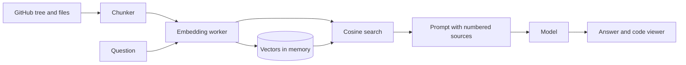
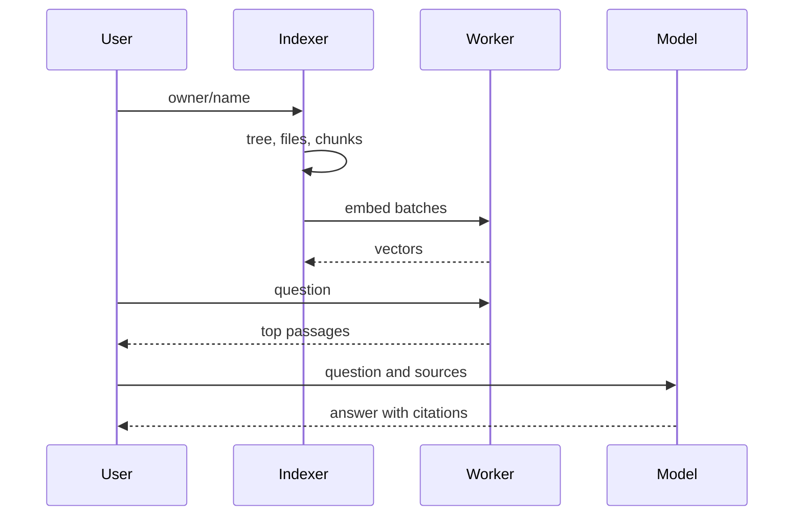

# Architecture

## Data flow

## Main sequence

## Modules

| Path | Responsibility |
|---|---|
| `lib/repo.ts` | Reference parsing, file selection, GitHub fetching |
| `lib/chunk.ts` | Chunking |
| `lib/indexer.ts` | Download, chunk and embed pipeline with stages |
| `lib/embedder.ts` | Client for the embedding worker |
| `lib/vector.ts` | Cosine retrieval and diversity |
| `lib/rag.ts` | Prompt and citation helpers |
| `components/` | Answer, code viewer, key box |

## Principles

- Pure logic lives in `lib/` and is tested without a browser; components stay thin.
- Network, storage and model replies are validated at the boundary.
- Secrets and user content stay in the browser.

## Decisions

- [Embeddings run locally in a worker](adr/0001-embeddings-run-locally-in-a-worker.md)
- [Bring your own key, browser only](adr/0002-bring-your-own-key-browser-only.md)
