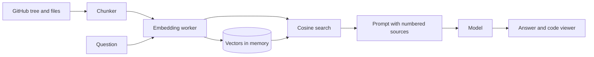
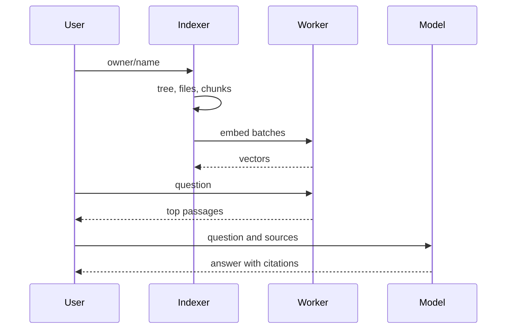

# Architecture

## Data flow

## Main sequence

## Modules

| Path | Responsibility |
|---|---|
| `lib/repo.ts` | Reference parsing, file selection, GitHub fetching |
| `lib/chunk.ts` | Chunking |
| `lib/indexer.ts` | Download, chunk and embed pipeline with stages |
| `lib/embedder-types.ts` | Shared `Embeddable` interface implemented by both embedders below |
| `lib/embedder.ts` | Client for the embedding Web Worker (browser) |
| `lib/embedder.server.ts` | Same MiniLM model, loaded inline in Node (server/MCP) |
| `lib/vector.ts` | Cosine retrieval and diversity |
| `lib/rag.ts` | Prompt and citation helpers |
| `lib/engine.server.ts` | Server-side index/ask orchestration used by the MCP tools |
| `lib/mcp-server.ts` | MCP tool registration (`index_repo`, `ask_repo`, `list_indexed_repos`) |
| `app/api/mcp/route.ts` | Streamable HTTP MCP endpoint, agent-facing |
| `components/` | Answer, code viewer, key box (human UI) |

## Principles

- Pure logic lives in `lib/` and is tested without a browser; components stay thin.
- Network, storage and model replies are validated at the boundary.
- Secrets and user content stay in the browser for the human UI; the MCP server reads optional LLM keys from the server environment instead, since there's no browser-held key for an agent caller.

## Decisions

- [Embeddings run locally in a worker](adr/0001-embeddings-run-locally-in-a-worker.md) (browser path; the server/MCP path runs the same model inline in Node — see `lib/embedder.server.ts`)
- [Bring your own key, browser only](adr/0002-bring-your-own-key-browser-only.md) (human UI; the MCP server instead reads an optional key from the server environment)
